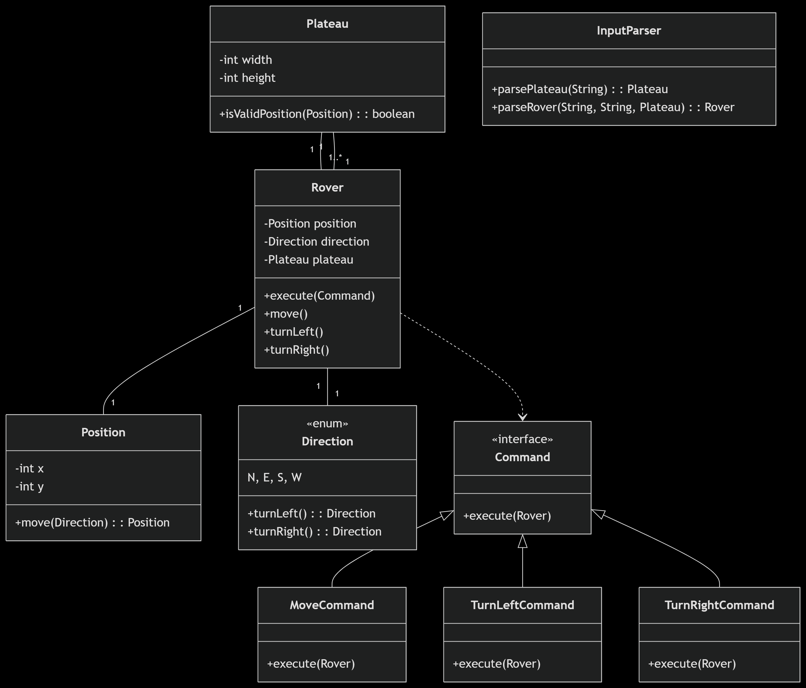

# 🚀 Mars Rover Simulation

This project is a clean, modular implementation of the classic **Mars Rover** exercise, written in Java using the principles of **OOP**, **SOLID**, and **Clean Code**.

---

## 📖 Problem Summary

NASA needs to land robotic rovers on a rectangular plateau on Mars. The rovers need to navigate the plateau and return their final position after executing a series of movement instructions.

Each rover has:
- A starting position (`x y Direction`)
- A set of instructions (`L`, `R`, `M`)

Where:
- `L` = Turn left 90°
- `R` = Turn right 90°
- `M` = Move forward

---

## 📁 Project Structure

```
src/
├── main/
│   ├── java/com/marsrover/
│   │   ├── model/        # Domain classes (Rover, Position, Plateau, Direction)
│   │   ├── command/      # Command Pattern: Move, TurnLeft, TurnRight
│   │   ├── parser/       # Input and command parsing
│   │   └── Main.java     # Entry point
│   └── resources/
│       └── input.txt     # Sample input file
└── test/                 # Unit tests (JUnit 5)
```

---

## 🧠 Architecture

This project follows the principles of **OOP**, **Clean Code** and **SOLID** to ensure maintainability, scalability, and testability.

### 🔹 Responsibilities by Layer

- **model/**: Core domain (Rover, Position, Direction, Plateau)
- **command/**: Follows the **Command Pattern** to encapsulate movement logic
- **parser/**: Translates the input file into domain objects
- **service/**: (if added) Orchestrates the business logic (currently optional)
- **Main.java**: Entry point that ties everything together

### 📐 Class Diagram

The following class diagram illustrates the key components and their relationships:



---

## 🛠️ Technologies Used

- Java 21+ (compatible with Java 24)
- Maven
- JUnit 5
- Lombok (to reduce boilerplate code)

---

## 🚀 Run Instructions

### 1. Build the project

```bash
mvn clean package
```

### 2. Run the program with the input file

```bash
java -jar target/rover.jar src/main/resources/input.txt
```

---

## ✅ Example

### Input (`input.txt`)
```
5 5
1 2 N
LMLMLMLMM
3 3 E
MMRMMRMRRM
```

### Output
```
1 3 N
5 1 E
```

---

## 👨‍💻 Author

Developed by Alassane BA for a technical interview with BNP Paribas.
